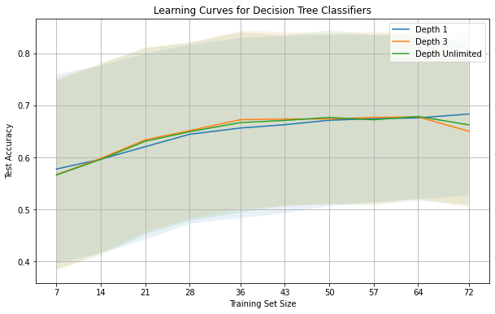
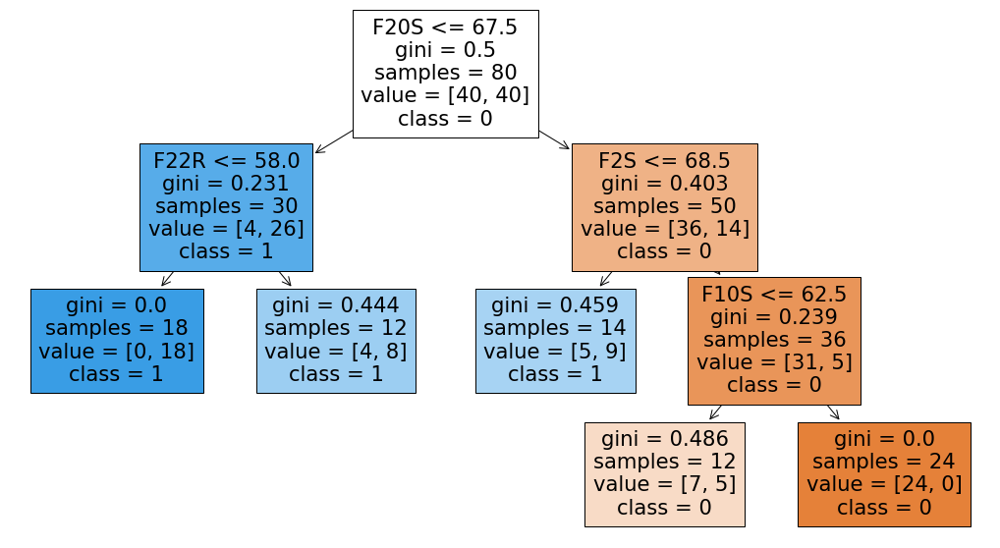
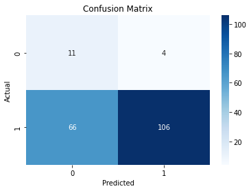

# AI Algorithms SPECTF Dataset

## Overview

The goal is to apply decision tree algorithms to the SPECTF dataset and analyze the results. 

## Process

1. **Data Preprocessing**: 
    - Load the SPECTF dataset.
    - Quick data assessment

2. **Evaluating performance of different decision trees**:
    - Implement a classifier using scikit-learn library.
    - Cross validation done using a manually created 10-fold cross-validation(check evaluate performance)
    - Also cross validation done using scikit under "Cross eval with scikit"

3. **Visualization**:
    - Visualize the learning curve for the different classifiers
    - 
    - Visualize the decision tree for the best classifier
    - 
    - Confusion matrix for the best classifier
    - 

## Files

- `spectf+heart/SPECTF.train`: Training dataset for the SPECTF dataset.
- `spectf+heart/SPECTF.test`: Test dataset for the SPECTF dataset.

## Requirements

- Python 3.10
- Libraries: scikit-learn, pandas, matplotlib, ipykernel

## Usage

1. Clone the repository.
2. Install the required libraries.
3. Run the script `spectf_dt.ipynb`.

